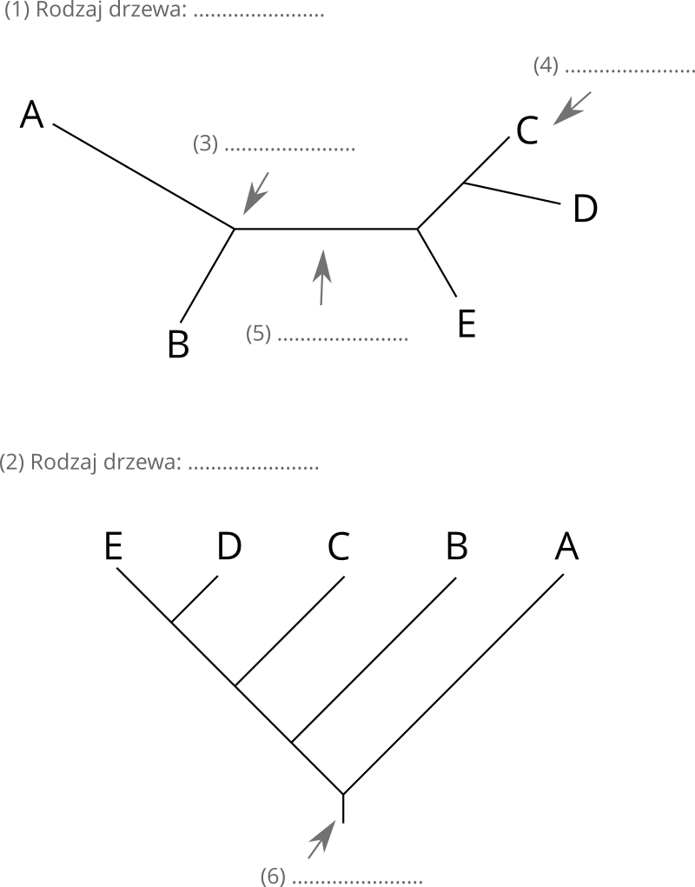
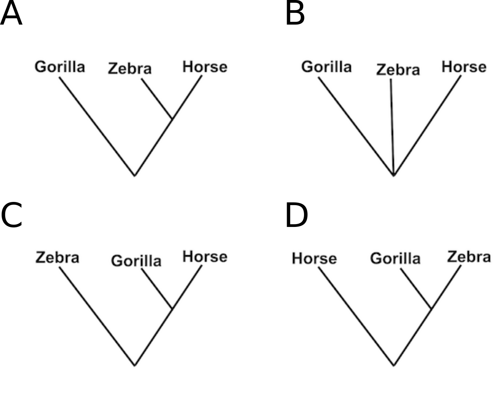

## Zadanie 1 - Dopasowanie wielu sekwencji
W pliku [ube.fasta](../data/ube.fasta) znajdują się sekwencje białkowe **aktywnego** enzymu koniugującego ubikwitynę pochodzące z wielu organizmów. Korzystając z programu [Clustal Omega](https://www.ebi.ac.uk/jdispatcher/msa/clustalo) na serwerze EBI wykonaj ich przyrównanie.

Odpowiedz:

1. Co oznaczają znaki `*`, `:` i `.` w przyrównaniu?
2. Wypisz aminokwasy, które są całkowicie zachowane u wszystkich organizmów.

W białkowej bazie NCBI istnieją dwa białka drożdży o numerach dostępu: `NP_588162` i `NP_011428`, które należą do tej samej rodziny białkowej, ale **nie posiadają** aktywności katalitycznej. Otwórz program `ClustalOmega` w nowej karcie przeglądarki i wykonaj przyrównanie sekwencji z pliku `ube.fasta` dodając do niego dwie sekwencje z drożdży.

3. Porównaj wyniki obu przyrównań i zidentyfikuj aminokwas kluczowy dla aktywności enzymu. Uzasadnij swoją odpowiedź.
4. Zapisz wynik przyrównania do pliku (*Download*).


## Zadanie 2 - Logo sekwencji

Korzystając z narzędzia [WebLogo3](https://weblogo.threeplusone.com), utwórz (*Create*) logo sekwencji UBE na podstawie pliku pobranego w poprzednim zadaniu.

Odpowiedz:

1. Ile pozycji (kolumn) zawiera logo sekwencji?
2. Wypisz najczęściej pojawiającą się sekwencję, która jest w lokalizacji 178-182.


## Zadanie 3 - Podstawy interpretacji drzew filogenetycznych

1. Określ typ drzewa oraz opisz, co oznaczają jego elementy.

<p align="center"></p>

2. Na czym polega różnica w interpretacji między drzewem nieukorzenionym a ukorzenionym?


## Zadanie 4 - Porównanie topologii drzew filogenetycznych

Poniższe drzewa są nieukorzenione, a długości ich gałęzi nie odpowiadają odległości ewolucyjnej. Które drzewa są ze sobą równoważne?

<p align="center"></p>


## Zadanie 5 - Relacje filogenetyczne gatunków

Poniższa tabela przedstawia przyrównanie sekwencji trzech gatunków.

````
Gorilla   KEHK
Horse     RKHK
Zebra     RKHK
          ::**
````

Które drzewo najodpowiedniej opisuje relację między powyższymi gatunkami.

<p align="center"></p>


## Zadanie 6 - Analiza filogenetyczna wirusów HIV i SIV na podstawie białka gp120
**AIDS (Acquired Immune Deficiency Syndrome)** jest wywoływany przez wirusy HIV-1 i HIV-2, z których pierwszy odpowiada za globalną pandemię. Spokrewnione wirusy występują również u naczelnych i określane są jako SIV. Białko gp120 odpowiada za wiązanie wirusa z komórkami gospodarza.

W pliku [gp120.fasta](../data/gp120.fasta) znajduje się przyrównanie sekwencji tego białka z różnych gatunków naczelnych. Korzystając z narzędzia simple phylogeny [MAB-LIRMM](http://phylogeny.lirmm.fr/phylo_cgi/simple_phylogeny.cgi), utwórz drzewo filogenetyczne i ukorzeń je metodą *mid-point rooting*.

Odpowiedz:
1. Czy wirusy HIV-1 i HIV-2 stanowią jedną grupę, czy raczej stanowią dwie odrębne grupy na drzewie?
2. Który wirus naczelnych jest najbardziej spokrewniony z wirusami HIV-1?


## Zadanie 7 - Rekonstrukcja źródła zakażenia HIV na podstawie analizy filogenetycznej

W latach 90. u 8 pacjentów dentysty z Florydy zdiagnozowano zakażenie wirusem HIV. W związku z tym, że dentysta był chory na AIDS oraz przeprowadzał inwazyjne procedury dentystyczne, amerykańska agencja epidemiologiczna przeprowadziła śledztwo. Nie wykazało ono istotnych uchybień podczas wykonywanych zabiegów w zakresie bezpieczeństwa i higieny.

W celu ustalenia źródła zakażenia wirusem HIV, wyizolowałeś/aś wirusowe RNA z próbek krwi osób zakażonych: dentysty (dwie próbki), pacjentów dentysty oraz innych osób z okolic Florydy niemających kontaktu z dentystą. Sekwencje wirusowego białka gp120, które otrzymałeś/aś znajdują się w pliku  [HIV_data_set.fasta](../data/HIV_data_set.fasta). Przeprowadź analizę filogenetyczną w programie `MEGA`


* Otwórz program MEGA.
* Wczytaj sekwencje w programie (`Align` > `Edit/Build Alignment` > `Retrieve sequences from a file`).
* Zaznacz wszystkie sekwencje (`Edit` > `Select all`) i przeprowadź ich przyrównanie (`Alignment` > `Align by ClustalW`) korzystając z domyślnych ustawień.

1. Jaka jest długość przyrównania?
2. Ile jest pozycji w przyrównaniu, gdzie aminokwas jest zachowany we wszystkich sekwencjach?
3. Które kolumny przyrównania nie będą pomocne w analizie filogenetycznej?

* W oknie przyrównania sekwencji wybierz z menu wybierz `Data` > `Phylogenetic Analysis`.
* W głównym oknie programu MEGA wygeneruj drzewo używając algorytmu *Neighbor-Joining (NJ)* 
   * `Analysis` > `Phylogeny` > `Construct/Test Neighbor-Joining tree`.
* W opcjach `Test of Phylogeny` ustaw `None`.
* Naciśnij przycisk `Compute`.


4. Czy dentysta mógł zakazić któregokolwiek z pacjentów?
5. Co oznacza długość gałęzi w tym drzewie?
6. Która para białek gp120 jest najbliżej spokrewniona, a która najdalej?


## Zadanie 8 - Budowa profilu sekwencji
W oparciu o poniższe przyrównanie wielu sekwencji utwórz w tabeli profil, który będzie przedstawiał ile razy dany nukleotyd występuje w danej pozycji (kolumnie).

```
ATCGTA  
ATCGCA  
TCCTTA  
CTGATT  
CTTGTC  
```

Odpowiedz:

1. Ile wynosi wartość punktacji dla heksameru `AGTATT`, jeżeli punktacja jest sumą liczności aminokwasów w odpowiednich kolumnach profilu.
2. Przyrównanie jakiego, dowolnego heksameru będzie najwyżej punktowane?